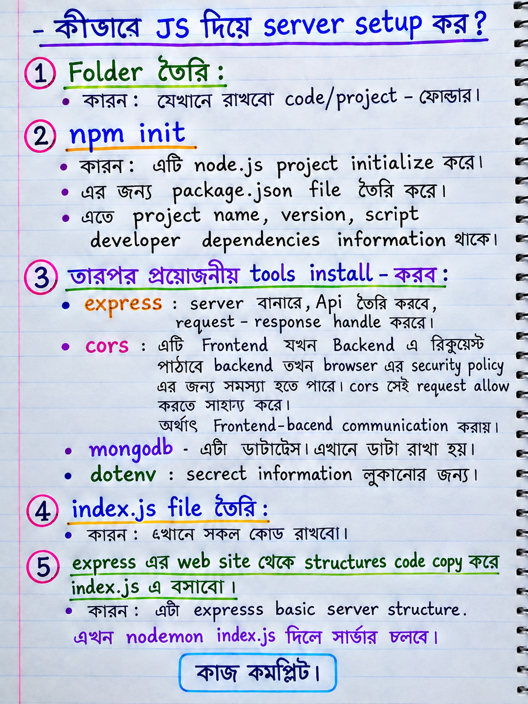
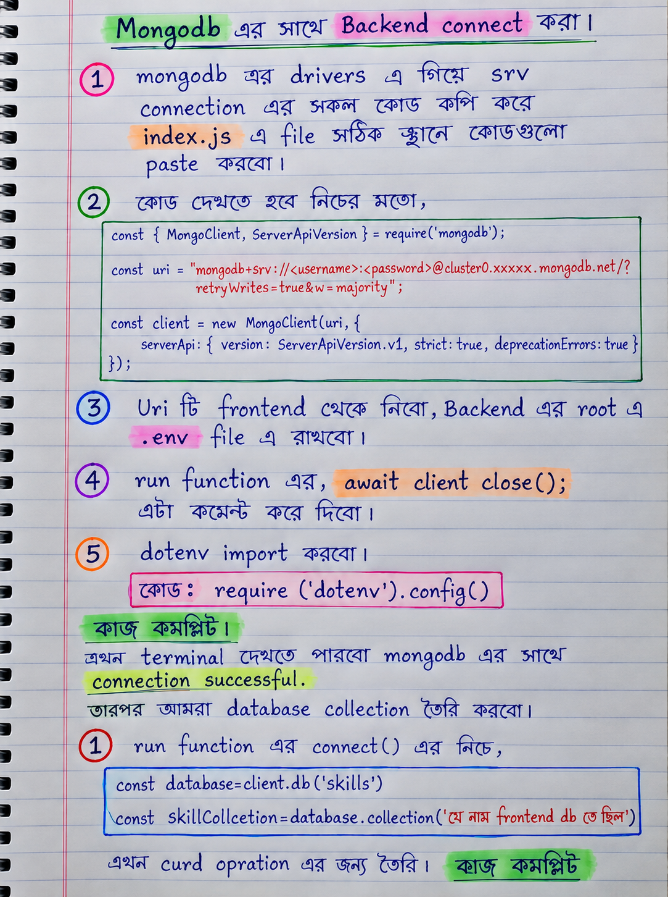

# 🚀 JS Server Setup
---
## 📌 server Setup Overview

#### 1. Folder maked
#### 2. 📦 Initialize Node.js Project

```bash
npm init -y
```

#### 3. 📥 Install Required Packages

```bash
npm i cors mongodb dotenv express
```
#### 4. index.js file create
#### 5. express web side structure code paste


---
## 📌 Connect the backend with MongoDB.
  1. srv connection all code paste in index.js
  2. Frontend uri copy and paste .env file
  3. await client close() ; this line -comment
  4. require('dotenv').config();
  5.const cors=require('cors')
  app.use(cors())
  app.use(express.json())

---

---

## 🟢 1. JavaScript Server Setup & MongoDB Connection

<div style="display: flex; gap: 20px; flex-wrap: wrap;">

  

  

</div>

---
### 💻 Initial server ready code (index.js)

```javascript
const express = require('express');
const cors=require('cors')
const app = express()
const port = 5000
const { MongoClient, ServerApiVersion } = require('mongodb');
require('dotenv').config()
app.use(cors())
app.use(express.json())


app.get('/', (req, res) => {
  res.send('Server is working.....')
})

// mongodb drivers codes
const uri = process.env.MONGODB_URI

// Create a MongoClient with a MongoClientOptions object to set the Stable API version
const client = new MongoClient(uri, {
  serverApi: {
    version: ServerApiVersion.v1,
    strict: true,
    deprecationErrors: true,
  }
});

async function run() {
  try {
    // Connect the client to the server	(optional starting in v4.7)
    await client.connect();

    // collections
    
    const database=client.db('khalekuzzaman')
    const skillCollection=database.collection("skill")


    // post skill

    app.post('/skill/post',async(req,res)=>{
      const job=req.body
      const result=await skillCollection.insertOne(job)
      res.send(result)
    })

    // Send a ping to confirm a successful connection
    await client.db("admin").command({ ping: 1 });
    console.log("Pinged your deployment. You successfully connected to MongoDB!");
  } finally {
    // Ensures that the client will close when you finish/error
    // await client.close();
  }
}
run().catch(console.dir);


app.listen(port, () => {
  console.log(`Example app listening on port ${port}`)
})
```

---
